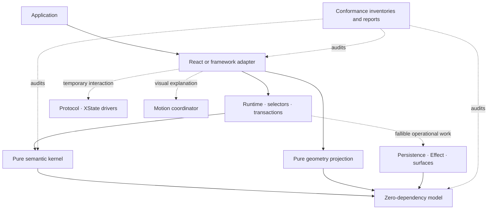

# Panefold

Panefold is an experimental, deterministic workspace runtime for building IDEs, map tools,
operations consoles, and other panel-heavy web applications.

This repository is an executable implementation companion to the
[Panefold system design](docs/spec/SYSTEM_DESIGN.md). Version `0.1.0` remains experimental: the
semantic model, 36-command reference kernel, geometry, runtime, adapters, and operational
primitives are implemented and tested in the repository, but the project does **not** claim stable
conformance, product certification, npm publication, or unrestricted browser-window behavior.

## What works today

- Immutable schema-v2 workspace snapshots with normalized panels, groups, layout nodes, surfaces,
  activation, focus memory, recoverable closes, and bounded remote receipts.
- A zero-runtime-dependency model and pure reference kernel with all 36 semantic commands,
  canonicalization, invariants, typed rejection, patches, transaction receipts, batching, and
  bounded workspace undo/redo.
- An experimental optimized projection with derived indexes, bounded history, patch replay,
  seeded differential smoke runs, and a reproducible lookup microbenchmark. It is not yet an
  independently reducing optimized kernel.
- A logical-axis n-ary geometry solver with panel constraints, collapse state, exact integer
  conservation, overflow diagnostics, splitters, hit tests, and drop targets.
- A React projection that uses the geometry allocator, driver-isolated resize protocols,
  frame-coalesced previews, accessible tabs and splitters, focus recovery, stable panel hosts,
  lifecycle leases, and optional FLIP motion.
- A bounded synchronous runtime plus versioned persistence codecs, atomic snapshot/journal
  contracts, deterministic schema migration, last-known-good recovery, and an IndexedDB/Effect
  adapter tested with injected storage. Real browser crash and quota certification is still absent.
- Driver-neutral protocol contracts, XState machines for drag, resize, persistence, transfer, and
  coordinator election, plus a prepared external-surface ownership coordinator. These are protocol
  primitives, not a browser popout or Picture-in-Picture product profile.
- Native experimental Vue, Svelte, Angular, and Web Components bindings over a shared immutable
  adapter contract. Current cross-framework evidence is a JSDOM contract harness, not real-browser
  framework certification.
- Experimental trusted-plugin, bounded devtools, remote-command-intake, and mobile-projection
  primitives. They are not untrusted-plugin isolation, durable collaboration, or a certified mobile
  experience.
- A machine-checkable 190-requirement register, 36-command parity check, capability/evidence
  inventories, trace matrix, and explicit accounting for all ten hard release gates.

Read [Command support](docs/COMMANDS.md), [Support matrix](docs/SUPPORT.md), and
[Conformance status](docs/CONFORMANCE.md) before adopting any package.

## Architecture



Only the semantic kernel owns committed workspace state. Geometry is derived; interaction and
motion are temporary; frameworks project immutable snapshots; persistence and surfaces perform
fallible work through explicit contracts. See [Architecture](docs/ARCHITECTURE.md) and the accepted
[ADRs](docs/adr/).

## Workspace packages

The workspace contains the private root project, the demo application, and the following 18 library
packages. Every library below is version `0.1.0`, experimental, workspace-local, and unpublished to
npm.

| Package                      | Current responsibility                                                                |
| ---------------------------- | ------------------------------------------------------------------------------------- |
| `@panefold/model`            | Schema-v2 records, branded IDs, 36-command inventory, results, factories, JSON guards |
| `@panefold/kernel`           | Reference reduction, canonicalization, invariants, patches, hashes, history dispatch  |
| `@panefold/kernel-optimized` | Experimental indexes, persistent buckets, patch projection, differential smoke tools  |
| `@panefold/geometry`         | Constraint aggregation, n-ary allocation, resolved rectangles, hit/drop testing       |
| `@panefold/runtime`          | Bounded dispatch, policies, selectors, persistence codecs, journals, durable runtime  |
| `@panefold/runtime-effect`   | Optional Effect wrappers and injected IndexedDB journal adapter                       |
| `@panefold/protocol`         | Driver-neutral protocol identities, scopes, clocks, and bounded traces                |
| `@panefold/protocol-xstate`  | XState drivers for drag, resize, persistence, transfer, and election                  |
| `@panefold/surfaces`         | Capability intersection, geometry clamping, prepared transfer, ownership, recovery    |
| `@panefold/motion`           | Motion plans, channels, frame scheduling, FLIP, coordinator, Motion DOM driver        |
| `@panefold/adapter-contract` | Shared immutable source, selection, subscription, dispatch, and disposal contract     |
| `@panefold/react`            | React external-store binding, accessible renderer, stable hosts, geometry bridge      |
| `@panefold/vue`              | Vue shallow-ref binding and effect-scope disposal                                     |
| `@panefold/svelte`           | Svelte readable store and component lifecycle helper                                  |
| `@panefold/angular`          | Angular signal binding, provider, injection, and `DestroyRef` disposal                |
| `@panefold/web-components`   | SSR-safe custom-element factory and source/dispatch bridge                            |
| `@panefold/ecosystem`        | Trusted plugin registry, devtools, remote intake, and mobile data projection          |
| `@panefold/conformance`      | Manifest, command, capability, evidence, requirement, gate, and report validation     |

`@panefold/demo` is the workspace application used for the Atlas reference fixture; it is not a
published package or a support certification.

## Run the demo

Requirements: Node.js 22 or newer and pnpm 11.

```bash
corepack enable
pnpm install
pnpm dev
```

Open the URL printed by Vite. Atlas exercises a compact map-operations workspace with tabs,
keyboard commands, splitters, stable content hosts, close/reopen, structural movement, and
undo/redo. It is a demonstration and automated reference fixture, not evidence for every browser,
input, framework, or workload.

## Verify the repository

```bash
pnpm check
pnpm test:e2e
```

`pnpm check` runs formatting, dependency-boundary linting, source security checks, generated
requirement and conformance-data drift checks, package builds, conformance validation, a Node
performance smoke workload, strict TypeScript, tests, and the demo production build. The separate
Playwright suite covers the declared Chromium reference fixture. A green local or CI run is
repository evidence only; it does not replace manual assistive-technology work, physical 60/120 Hz
traces, independent security review, real crash testing, or third-party pilots.

## Kernel usage

```ts
import { commandId, createWorkspaceSnapshot, panelId } from "@panefold/model";
import { executeCommand } from "@panefold/kernel";

const initial = createWorkspaceSnapshot(/* normalized records */);
const result = executeCommand(initial, {
  id: commandId("command:select-map-canvas"),
  origin: "application",
  label: "Select map canvas",
  baseRevision: initial.revision,
  command: {
    type: "select-panel",
    panelId: panelId("map.canvas"),
  },
});

if (!result.ok) {
  console.error(result.error.code, result.error.remediation);
} else {
  console.log(result.next.revision, result.patches);
}
```

Expected failures are typed result values. A rejected command cannot advance revision or publish a
partial snapshot.

## Project status

All current packages and profiles are experimental. The repository does not claim stable WCAG 2.2
AA conformance, performance certification, heavy-content certification, browser popout/Picture-in-
Picture support, multi-screen support, durable distributed collaboration, dynamic untrusted-plugin
isolation, mobile certification, or a completed security review. Those boundaries are intentional
and machine-readable in `conformance/`.

Engineering progress and missing exit evidence are separated in the [Roadmap](docs/ROADMAP.md).
Architectural changes require an ADR.

## Contributing

Read [CONTRIBUTING.md](CONTRIBUTING.md). Report suspected vulnerabilities through the private flow
described in [SECURITY.md](SECURITY.md), not a public issue.

## License

[MIT](LICENSE)
