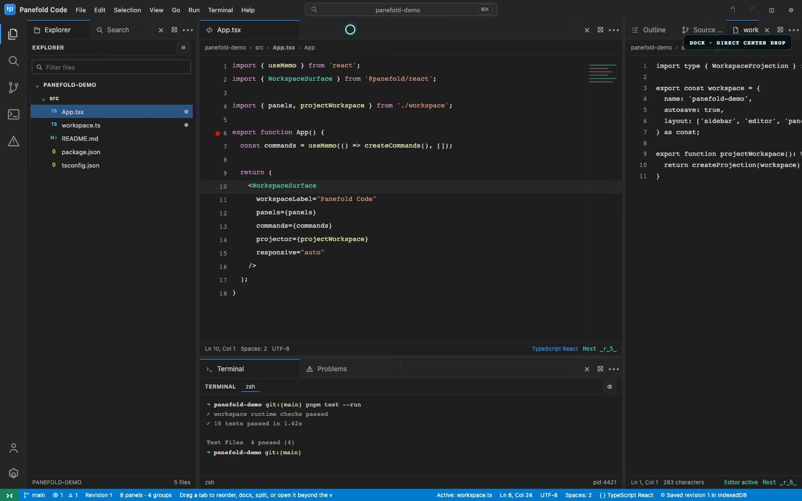
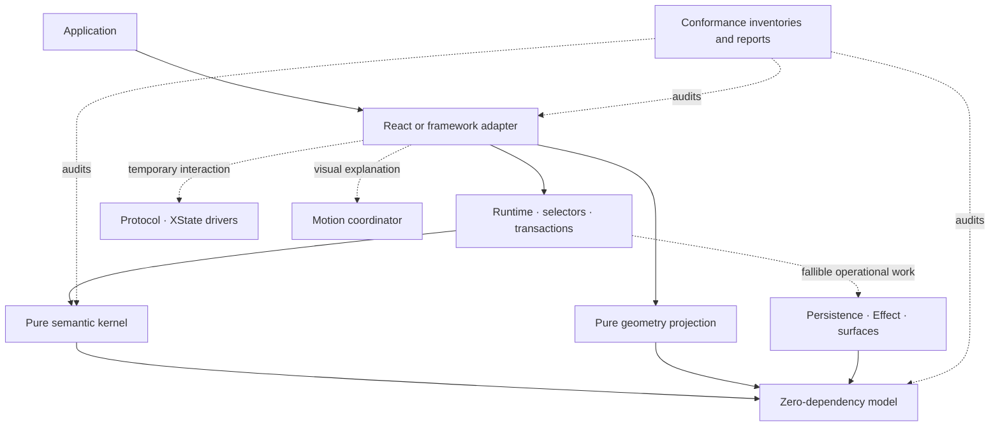

# Panefold

[](https://github.com/natanelia/panefold/actions/workflows/ci.yml)
[](docs/SUPPORT.md)

**A deterministic workspace runtime for web applications that need to feel like crafted desktop
tools.** Panefold provides the semantic model, geometry, interactions, persistence, and framework
adapters behind IDEs, map tools, operations consoles, and other panel-heavy products.

[Website](https://natanelia.github.io/panefold/) ·
[Live demo](https://natanelia.github.io/panefold/workbench/) ·
[Documentation](https://natanelia.github.io/panefold/docs/) ·
[Source](https://github.com/natanelia/panefold)

[](https://natanelia.github.io/panefold/workbench/)

**[Watch the interaction film](https://natanelia.github.io/panefold/media/panefold-interactions.webm)**
· [Try the live workspace](https://natanelia.github.io/panefold/workbench/)

| Deterministic by design                                                                | Interaction craft                                                                   | Failure-aware foundations                                                                             |
| -------------------------------------------------------------------------------------- | ----------------------------------------------------------------------------------- | ----------------------------------------------------------------------------------------------------- |
| One immutable command model makes layout, focus, history, and persistence explainable. | Exact drop previews, stable panel hosts, accessible tabs, and responsive splitters. | Bounded protocols, typed rejection, atomic persistence, and explicit recovery paths—not hidden state. |

> **Use Panefold today**
>
> - **Explore:** open the [live Panefold Code demo](https://natanelia.github.io/panefold/workbench/).
> - **Evaluate:** clone this repository and follow [Run the demo](#run-the-demo).
> - **Install:** npm packages are **not published**. Version `0.1.0` is available from source and
>   as private workspace packages only.

Panefold `0.1.0` is an **experimental source snapshot** and executable companion to the
[system design](docs/spec/SYSTEM_DESIGN.md). Its 36-command reference kernel, geometry, runtime,
adapters, and operational primitives are implemented and tested here. It does **not** claim stable
conformance, product certification, npm availability, or unrestricted browser-window behavior.

## What works today

- Immutable schema-v2 workspace snapshots with normalized panels, groups, layout nodes, surfaces,
  activation, focus memory, recoverable closes, bounded remote receipts, and typed versioned panel
  parameter/checkpoint registries with recoverable missing-provider placeholders.
- A zero-runtime-dependency model and pure reference kernel with all 36 semantic commands,
  canonicalization, invariants, typed rejection, patches, transaction receipts, batching, and
  bounded workspace undo/redo.
- An experimental optimized projection with derived indexes, bounded history, patch replay,
  a chunkable all-command differential campaign, and a reproducible lookup microbenchmark. A
  separate correctness-first reducer makes semantic decisions without calling the reference
  reducer and is compared as a complete-result oracle. It rebuilds Map/entity state per command,
  so it is not presented as the retained optimized production kernel; recorded runs also remain
  below the stable ten-million threshold.
- A logical-axis n-ary geometry solver with panel constraints, collapse state, exact integer
  conservation, overflow diagnostics, working splitters, and deterministic non-overlapping drop
  targets.
- A React projection that uses the geometry allocator, driver-isolated resize protocols,
  frame-coalesced previews, direct center/edge panel docking, accessible tabs and splitters, four-way
  keyboard/menu splitting, configurable logical tab rails and content, focus recovery, stable panel
  hosts, lifecycle leases, and optional FLIP motion.
- A bounded synchronous runtime with transaction-correlated post-commit effect delivery and
  in-process duplicate suppression, plus versioned persistence codecs, atomic snapshot/journal
  contracts, deterministic schema migration, last-known-good recovery, a restore-before-render open
  path, observable save status, and IndexedDB/Effect adapters. Panefold Code visibly reports the
  exact saved/restored canonical revision. Crash-durable effect deduplication, real browser crash, and
  quota certification are still absent.
- Driver-neutral protocol contracts and a public twelve-actor XState catalog with scoped disposal,
  deterministic traces, revision-conflict handling, and prepared external-surface ownership. The
  injected same-origin browser adapter opens, bootstraps, observes, recovers, and closes a real
  Chromium popup containing the same live React panel host. Picture-in-Picture, arbitrary origins,
  and unrestricted popouts are still not a certified product profile.
- Native experimental Vue, Svelte, Angular, and Web Components bindings over a shared immutable
  adapter contract. Current cross-framework evidence is a JSDOM contract harness, not real-browser
  framework certification.
- Experimental trusted plugins with scoped cleanup, a sandboxed-iframe isolation host, bounded
  devtools/reproductions, HMAC-authenticated single-writer remote coordination, and a reversible
  React single-region touch projection. These are deployable primitives, not a durable
  collaboration service, arbitrary-code security certification, or physical mobile certification.
- A public testkit with the eight normative workload manifests, all 17 representative panel
  fixtures, structural input-parity data, ownership exploration, lifecycle torture, and statistics.
- A machine-checkable 190-requirement register, 36-command parity check, capability/evidence
  inventories, trace matrix, and explicit accounting for all ten hard release gates.

Read [Command support](docs/COMMANDS.md), [Support matrix](docs/SUPPORT.md),
[Conformance status](docs/CONFORMANCE.md), and the requirement-by-requirement
[system-design audit](docs/DESIGN_AUDIT.md) before adopting any package.

## Architecture



Only the semantic kernel owns committed workspace state. Geometry is derived; interaction and
motion are temporary; frameworks project immutable snapshots; persistence and surfaces perform
fallible work through explicit contracts. See [Architecture](docs/ARCHITECTURE.md) and the accepted
[ADRs](docs/adr/).

## Workspace packages

The workspace contains the private root project, the demo application, and the following 19 library
packages. Every library below is version `0.1.0`, experimental, workspace-local, and unpublished to
npm.

| Package                      | Current responsibility                                                                |
| ---------------------------- | ------------------------------------------------------------------------------------- |
| `@panefold/model`            | Schema-v2 records, branded IDs, 36-command inventory, results, factories, JSON guards |
| `@panefold/kernel`           | Reference reduction, canonicalization, invariants, patches, hashes, history dispatch  |
| `@panefold/kernel-optimized` | Experimental indexes/projection, independent semantic oracle, differential campaigns  |
| `@panefold/geometry`         | Constraint aggregation, n-ary allocation, resolved rectangles, hit/drop testing       |
| `@panefold/runtime`          | Bounded dispatch, post-commit effect delivery, policies, persistence, durable runtime |
| `@panefold/runtime-effect`   | Optional Effect bridges and injected IndexedDB journal adapter                        |
| `@panefold/protocol`         | Driver-neutral protocol identities, scopes, clocks, and bounded traces                |
| `@panefold/protocol-xstate`  | Twelve bounded XState protocol actors with scoped identity and deterministic traces   |
| `@panefold/surfaces`         | Prepared ownership plus injected popup/PiP adapters, bootstrap, loss recovery         |
| `@panefold/motion`           | Scoped motion leases, channels, FLIP/View Transition fallback, load-aware planning    |
| `@panefold/adapter-contract` | Shared immutable source, selection, subscription, dispatch, and disposal contract     |
| `@panefold/react`            | React external-store binding, accessible renderer, stable hosts, geometry bridge      |
| `@panefold/vue`              | Vue shallow-ref binding and effect-scope disposal                                     |
| `@panefold/svelte`           | Svelte readable store and component lifecycle helper                                  |
| `@panefold/angular`          | Angular signal binding, provider, injection, and `DestroyRef` disposal                |
| `@panefold/web-components`   | SSR-safe custom-element factory and source/dispatch bridge                            |
| `@panefold/ecosystem`        | Plugin isolation, authenticated coordination, devtools, reproduction, mobile data     |
| `@panefold/testkit`          | Workload manifests, 17 panel fixtures, parity, ownership, lifecycle, and statistics   |
| `@panefold/conformance`      | Claims, proof classes, gates, reports, and third-party certification validation       |

`@panefold/demo` is the VS Code-like reference workbench application; it is not a published package
or a support certification.

## Run the demo

Requirements: Node.js 22 or newer and pnpm 11.

```bash
corepack enable
pnpm install
pnpm dev
```

Open the URL printed by Vite. Panefold Code lets you drag an editor into another group, drop it on
any logical edge to create a group, remove a container with its visible **⊠** action, drag it beyond
the workspace into a controlled same-origin browser window, split from the keyboard/menu, resize
splitters, choose top/bottom/vertical and icon/label tab chrome,
and reload the canonical arrangement from IndexedDB. Stable panel-host identity, undo/redo, a mobile
single-region projection, and an optional 17-kind lifecycle lab remain observable in the same
fixture. Panel-owned document content needs an application checkpoint codec; the demo does not imply
support for every browser, input, framework, workload, or deployment.

### Direct-interaction proof in Panefold Code

1. Drag **workspace.ts** onto the center of **Outline** to dock it in that tab group.
2. Drag **workspace.ts** before or after **App.tsx** in the same editor tab strip. The insertion
   marker, sibling preview, and final order use one relational reorder command; **Alt+Arrow** and
   the Actions menu expose the same operation.
3. Drag a tab onto a group edge—or use **Actions → Split left/right/above/below**—to create a new
   container in one undoable transaction.
4. Choose the visible **⊠ Remove panel container** action to merge all tabs into the nearest
   container and collapse the split in one undoable transaction. It also works for empty retained
   containers.
5. Drag a popout-capable editor beyond the workbench, or choose **Open in new window**, to move the
   live host into a same-origin popup. Edit workspace.ts there, then return or close the popup to see
   recovery.
6. Open **Workspace appearance** to select a logical tab rail and icon/label treatment.
7. Wait for **Saved revision _n_ in IndexedDB**, reload, and inspect **Restored revision _n_** plus
   the recovered layout.

## Verify the repository

```bash
pnpm check
pnpm test:e2e
pnpm test:site:e2e
```

`pnpm check` runs formatting, dependency-boundary linting, source security checks, generated
requirement and conformance-data drift checks, package builds, conformance validation, a Node
performance smoke workload, strict TypeScript, tests, and the demo plus website production builds.
The two Playwright suites cover the declared Chromium reference fixture and the responsive
marketing/documentation experience. A green local or CI run is repository evidence only; it does
not replace manual assistive-technology work, physical 60/120 Hz traces, independent security
review, real crash testing, or third-party pilots.

## Kernel usage

```ts
import { commandId, createWorkspaceSnapshot, panelId } from "@panefold/model";
import { executeCommand } from "@panefold/kernel";

const initial = createWorkspaceSnapshot(/* normalized records */);
const result = executeCommand(initial, {
  id: commandId("command:select-map-canvas"),
  origin: "application",
  label: "Select map canvas",
  baseRevision: initial.revision,
  command: {
    type: "select-panel",
    panelId: panelId("map.canvas"),
  },
});

if (!result.ok) {
  console.error(result.error.code, result.error.remediation);
} else {
  console.log(result.next.revision, result.patches);
}
```

Expected failures are typed result values. A rejected command cannot advance revision or publish a
partial snapshot.

## Project status

All current packages and profiles are experimental. The repository does not claim stable WCAG 2.2
AA conformance, physical performance or heavy-content certification, unrestricted browser
popout/Picture-in-Picture or multi-screen support, a hosted durable collaboration product,
arbitrary-code isolation certification, physical mobile certification, or a completed independent
security review. Those boundaries are intentional and machine-readable in `conformance/`.

Engineering progress and missing exit evidence are separated in the [Roadmap](docs/ROADMAP.md).
The public site and launch contract lives in [Marketing and launch](docs/MARKETING.md). Architectural
changes require an ADR.

## Contributing

Read [CONTRIBUTING.md](CONTRIBUTING.md). Report suspected vulnerabilities through the private flow
described in [SECURITY.md](SECURITY.md), not a public issue.

## License

[MIT](LICENSE)
