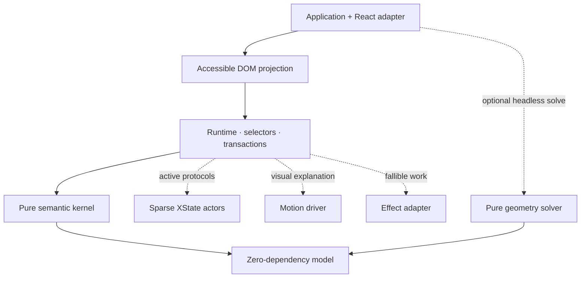

# Panefold

An experimental, deterministic workspace runtime for building IDEs, map tools, operations
consoles, and other panel-heavy web applications.

This repository is the first executable vertical slice of a larger normative system design. It is
deliberately released as **`0.1.0-experimental`**: the pure state model, transactional kernel,
constraint solver, runtime, and React projection are real; cross-window transfer, collaboration,
plugin isolation, non-React adapters, and stable conformance certification remain future work.

## What works today

- Immutable, normalized workspace state with stable panel, group, node, and surface identities.
- A pure TypeScript command kernel with deterministic canonicalization and invariant validation.
- Atomic commands, typed rejections, patches, transaction receipts, and layout undo/redo.
- N-ary split topology with logical axes and deterministic, constraint-aware pixel allocation.
- Fine-grained external-store subscriptions; React is a projection, never the source of truth.
- Accessible tabs and splitters, keyboard operation, serializable focus-recovery descriptors, and
  live announcements.
- Headless commands for docking, tab reordering, splitting, resizing, close/reopen, and in-page
  floating. The map-operations demo exercises tabs, group moves, splitters, close, and undo/redo.
- Driver-isolated XState interaction protocols, Motion DOM interpolation, and Effect operational
  adapters that do not leak into the headless model or kernel.

See [Command support](docs/COMMANDS.md), [Support matrix](docs/SUPPORT.md), and
[Conformance status](docs/CONFORMANCE.md) before adopting the project.

## Architecture



Only the semantic kernel owns committed workspace state. Geometry is derived, interaction protocol
state is temporary, motion explains an already-committed result, and fallible operational work sits
outside the reducer. In 0.1 the geometry package is tested independently; the compact React demo
still projects split weights with CSS and does not claim constraint-coupled rendering.

| Package                     | Responsibility                                                 |
| --------------------------- | -------------------------------------------------------------- |
| `@panefold/model`           | Branded IDs, immutable records, commands, errors, patches      |
| `@panefold/kernel`          | Pure reduction, canonicalization, invariants, inverse commands |
| `@panefold/geometry`        | N-ary constraint solving and exact rounded geometry            |
| `@panefold/runtime`         | Transaction queue, history, policies, selectors, subscriptions |
| `@panefold/runtime-effect`  | Optional Effect programs for operational ports                 |
| `@panefold/protocol-xstate` | Optional bounded drag and resize actors                        |
| `@panefold/motion`          | Driver-neutral motion plans and Motion DOM adapter             |
| `@panefold/react`           | React external-store adapter and accessible DOM renderer       |

The dependency graph is checked in CI. Model, kernel, and geometry cannot import DOM, React,
Effect, XState, or Motion.

## Run the demo

Requirements: Node.js 22 or newer and pnpm 11.

```bash
corepack enable
pnpm install
pnpm dev
```

Then open the URL printed by Vite. The demo is a map-operations workspace with route explorer,
map, layers, notes, feature inspection, validation, problems, and event-timeline panels.

## Verify the repository

```bash
pnpm check
pnpm test:e2e
```

`pnpm check` runs formatting, lint and dependency-boundary checks, strict TypeScript validation,
unit/property tests, and production builds.

## Kernel usage

```ts
import { commandId, createWorkspaceSnapshot, panelId } from "@panefold/model";
import { executeCommand } from "@panefold/kernel";

const initial = createWorkspaceSnapshot(/* normalized records */);
const result = executeCommand(initial, {
  id: commandId("command:select-map-canvas"),
  origin: "application",
  label: "Select map canvas",
  baseRevision: initial.revision,
  command: {
    type: "select-panel",
    panelId: panelId("map.canvas"),
  },
});

if (!result.ok) {
  console.error(result.error.code, result.error.remediation);
} else {
  console.log(result.next.revision, result.patches);
}
```

The exact exported helpers are also exercised in package tests and in the demo. All expected
failures are typed result values; a rejected command cannot advance revision or publish partial
state.

## Project status

This is not yet a stable, WCAG-certified, performance-certified, or multi-window-conformant release.
The end-state design defines 190 normative requirements and ten hard gates. Claiming completion
without the required model exploration, assistive-technology evidence, 60/120 Hz traces, recovery
matrix, and formal ownership verification would be misleading.

The staged plan is documented in [Roadmap](docs/ROADMAP.md). Architectural changes require an ADR.

## Contributing

Read [CONTRIBUTING.md](CONTRIBUTING.md). Security reports should follow [SECURITY.md](SECURITY.md)
rather than public issues.

## License

[MIT](LICENSE)
